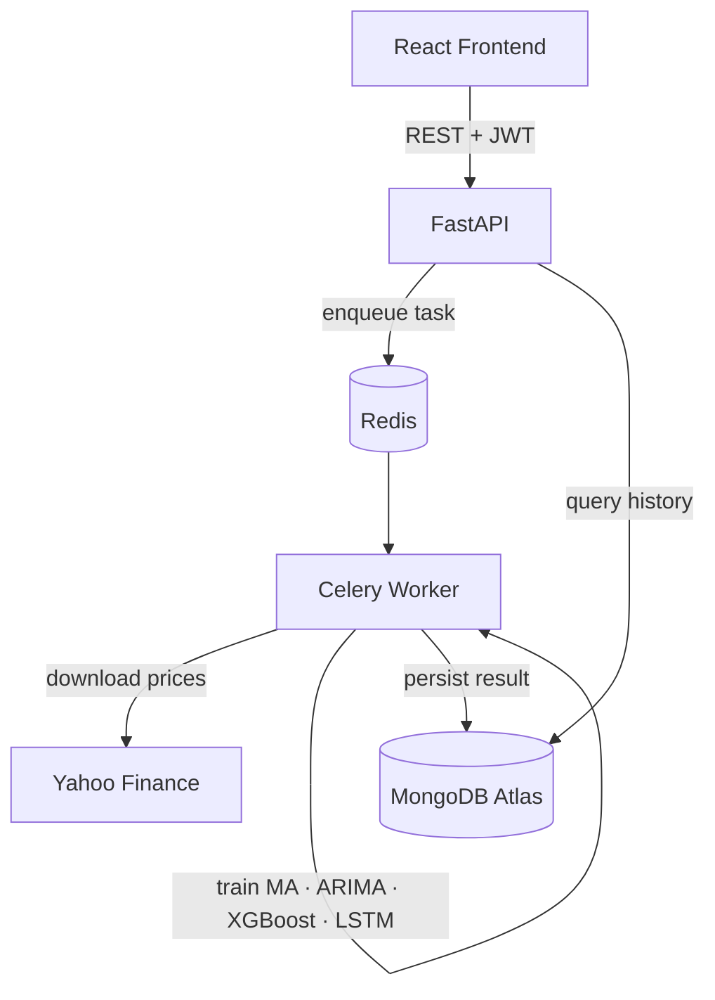

# Financial Forecast Comparator

Web platform that compares MA, ARIMA, XGBoost, and LSTM forecasts on any stock ticker. Users configure models and hyperparameters through a guided workspace, the backend trains each model in a Celery worker, and results are visualized side-by-side with error metrics and an AI-generated interpretation — all persisted per user in MongoDB.

## How it works

1. A user registers and signs in — credentials are stored in MongoDB, session managed with JWT
2. The workspace lets the user pick a ticker, date range, sampling interval, and hyperparameters per model
3. Clicking **Run Analysis** sends a request to FastAPI, which submits a Celery task and returns a `task_id` immediately
4. The **Celery worker** downloads market data from Yahoo Finance, trains each selected model, computes error metrics, and saves the result to MongoDB
5. The frontend polls the task status every 2 seconds and renders the results — predictions chart, metrics table, and model comparison — once complete

## Stack

| | |
|---|---|
| Frontend | React 18 + TypeScript + Vite + Tailwind CSS + shadcn/ui |
| Backend | FastAPI + Uvicorn |
| Async jobs | Celery + Redis + Flower |
| Auth | JWT (`python-jose`) + bcrypt |
| Database | MongoDB Atlas (Motor async / PyMongo sync) |
| Models | Moving Average · ARIMA · XGBoost · LSTM (PyTorch) |
| Market data | yfinance |
| Infra | Docker Compose |

## Model results — AAPL 2020–2024 (daily, 80/20 split)

| Model | MAE | RMSE | MAPE |
|---|---|---|---|
| ARIMA (0,1,0) | 2.69 | 4.05 | 1.20% |
| LSTM | 6.31 | 8.77 | 2.58% |
| Moving Average (window=30) | 9.34 | 11.67 | 4.08% |
| XGBoost | 16.97 | 23.98 | 6.78% |

ARIMA uses a rolling one-step-ahead expanding-window forecast, matching the evaluation methodology from the research notebooks.

## Architecture



## Run it

```bash
git clone https://github.com/<your-username>/Financial-Forecast-Comparator.git
cd Financial-Forecast-Comparator
```

Create `backend/.env`:

```env
MONGODB_URL=your_mongodb_atlas_connection_string
DB_NAME=financial_forecast
JWT_SECRET=your_strong_secret
JWT_ALGORITHM=HS256
JWT_EXPIRE_MINUTES=10080
REDIS_URL=redis://redis:6379/0
OPENAI_API_KEY=
```

```bash
docker compose up --build
```

```bash
cd frontend && npm install && npm run dev
```

| | |
|---|---|
| Frontend | http://localhost:8080 (`npm run dev`) |
| API | http://localhost:8000 |
| API docs | http://localhost:8000/docs |
| Flower | http://localhost:5555 |

## API

| Method | Endpoint | Description |
|---|---|---|
| POST | `/api/v1/auth/register` | Create account |
| POST | `/api/v1/auth/login` | Sign in |
| GET | `/api/v1/tickers/search?q=` | Ticker autocomplete |
| POST | `/api/v1/analyze` | Submit analysis job → `task_id` |
| GET | `/api/v1/tasks/{task_id}` | Poll task status and result |
| GET | `/api/v1/analyses` | List user's past analyses |
| GET | `/api/v1/analyses/{id}` | Fetch saved analysis |
| DELETE | `/api/v1/analyses/{id}` | Delete analysis |

## Project structure

```
Financial-Forecast-Comparator/
├── backend/
│   ├── app/
│   │   ├── models/          # MA, ARIMA, XGBoost, LSTM implementations
│   │   ├── routers/         # analyze, auth, tickers
│   │   ├── schemas/         # Pydantic request/response models
│   │   ├── celery_app.py
│   │   ├── tasks.py         # background analysis job
│   │   └── main.py
│   └── requirements.txt
├── frontend/
│   └── src/
│       ├── pages/           # workspace, results, history, about, auth
│       ├── components/      # chart, comparison table, analysis panel
│       └── lib/             # API client
├── notebooks/               # exploratory pipeline (01–08)
├── data/                    # raw, processed, results artifacts
└── docker-compose.yml
```
