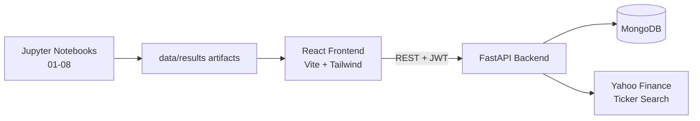
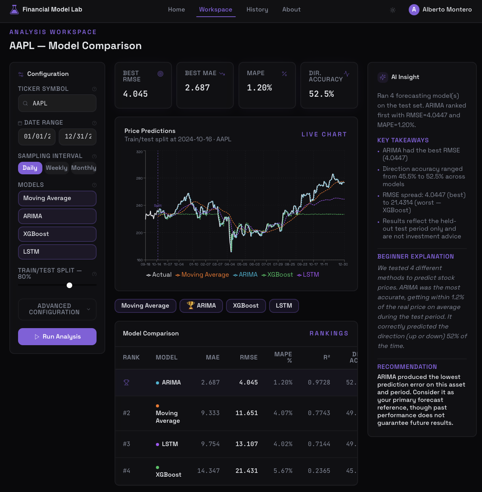
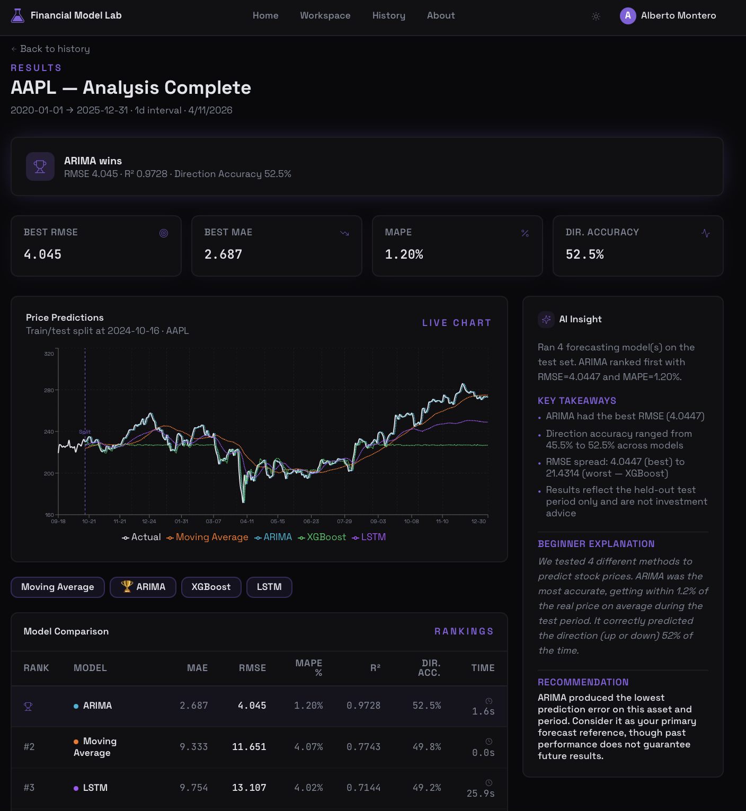

# Financial Forecast Comparator

End-to-end platform for comparing time-series forecasting models on financial data, with an interactive React dashboard, authentication, ticker discovery, and a notebook-based ML pipeline for ARIMA, XGBoost, LSTM, and Moving Average experiments.

## How it works

1. The user creates an account or signs in through the auth flow
2. The frontend lets users choose ticker symbols and model settings in a guided workspace
3. Backend services provide auth (JWT) and ticker search via Yahoo Finance
4. Model outputs and comparison artifacts are generated in notebooks and saved under `data/results`
5. The UI visualizes predictions, metrics, and LLM-style interpretation panels

## Stack

| | |
|---|---|
| Frontend | React 18 + TypeScript + Vite + Tailwind + shadcn/ui |
| State/Data | TanStack Query + React Hook Form + Zod |
| Backend API | FastAPI + Uvicorn |
| Auth | JWT (`python-jose`) + BCrypt |
| Database | MongoDB (Motor / PyMongo) |
| Market Data | yfinance (ticker search) |
| Modeling Workflow | Jupyter notebooks (ARIMA, XGBoost, LSTM, Moving Average, LLM interpretation) |

## Current status

- Implemented now:
	- Authentication endpoints (`register`, `login`)
	- Protected frontend routes (`workspace`, `results`, `history`)
	- Ticker search endpoint
	- Complete frontend UI and model-comparison screens
- In progress / next backend step:
	- Live analysis endpoints (`/api/v1/analyze`, `/api/v1/analyses`) currently represented in frontend types and consumed with mock data in UI screens

## Architecture



## Project structure

```text
Financial-Forecast-Comparator/
├─ backend/
│  ├─ app/
│  │  ├─ routers/            # auth + ticker endpoints
│  │  ├─ core/               # security helpers (JWT, password hashing)
│  │  ├─ config.py           # env-based settings
│  │  └─ main.py             # FastAPI app entrypoint
│  └─ requirements.txt
├─ frontend/
│  ├─ src/
│  │  ├─ pages/              # login/register/workspace/results/history/about
│  │  ├─ components/         # charts, tables, cards, auth UI, navbar
│  │  ├─ hooks/              # auth + theme providers
│  │  ├─ lib/                # API client + mock analysis data
│  │  └─ types/              # typed contracts for API payloads
│  └─ package.json
├─ notebooks/                # model development pipeline
├─ data/
│  ├─ raw/
│  ├─ processed/
│  └─ results/               # model outputs + interpretation artifacts
└─ README.md
```

## API overview

### Health

- `GET /health`

### Auth

- `POST /api/v1/auth/register`
- `POST /api/v1/auth/login`
- `GET /api/v1/auth/me` (placeholder pattern for protected profile fetch)

### Tickers

- `GET /api/v1/tickers/search?q=AAPL`

## Local setup

## 1. Clone repository

```bash
git clone https://github.com/<your-username>/Financial-Forecast-Comparator.git
cd Financial-Forecast-Comparator
```

## 2. Backend setup (FastAPI)

```bash
cd backend
python -m venv venv
source venv/bin/activate
pip install -r requirements.txt
```

Create `backend/.env`:

```env
MONGODB_URL=mongodb://localhost:27017
DB_NAME=financial_forecast
JWT_SECRET=replace_with_a_strong_secret
JWT_ALGORITHM=HS256
JWT_EXPIRE_MINUTES=10080
OPENAI_API_KEY=
```

Run backend:

```bash
uvicorn app.main:app --reload --port 8000
```

## 3. Frontend setup (Vite + React)

```bash
cd ../frontend
npm install
npm run dev
```

Frontend runs on `http://localhost:8080` by default.

## 4. Optional checks

```bash
# frontend
npm run build
npm run test
```

## Model outputs

The repository already includes sample result artifacts under `data/results`, including:

- `moving_average_AAPL.csv`
- `arima_AAPL.csv`
- `xgboost_AAPL.csv`
- `lstm_AAPL.csv`
- `llm_interpretation_AAPL.txt`

These files help validate charts, metrics, and comparison UX before full live API integration.

## Screenshots

Add your UI screenshots in a `docs/images/` folder and reference them here, for example:

```md



```

## Roadmap

- Wire real analysis endpoints from backend to frontend (`/api/v1/analyze`, history CRUD)
- Persist analysis runs per authenticated user in MongoDB
- Add model training/evaluation jobs as backend services
- Integrate production LLM explanation service for generated insights
- Add CI checks for lint/tests and API contract validation
